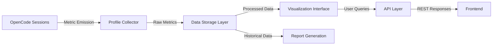

# OpenCode Profile Tool

OpenCode Profile Tool analyzes OpenCode sessions, tracks resource usage, and generates reports for profiling and debugging.



## Usage Examples

### API Endpoints

| Endpoint | Method | Description |
| --- | --- | --- |
| `/api/v1/sessions` | GET | List all monitored sessions |
| `/api/v1/metrics` | GET | Retrieve metric data with filtering |
| `/api/v1/reports` | GET | Generate comprehensive reports |
| `/api/v1/health` | GET | Health check endpoint |

### Sample API Call

```bash
curl -H "Authorization: Bearer YOUR_API_KEY" \
  "https://profile-tool.example.com/api/v1/metrics?session_id=ses_12345" \
  -G --data-urlencode "metric_type=cpu_usage" \
  --data-urlencode "start_time=2026-04-30T22:00:00Z" \
  --data-urlencode "end_time=2026-04-30T23:00:00Z"
```

## Development Setup

### Prerequisites

- Node.js 18+
- Docker (for database containers)
- pnpm (package manager)
- OpenCode CLI (for session integration testing)

### Installation

```bash
# Clone repository
git clone https://github.com/open-source-org/opencode-profile-tool.git
cd opencode-profile-tool

# Install dependencies
pnpm install

# Start database (SQLite for development)
docker-compose up -d

# Build frontend assets
pnpm run build

# Run development server
pnpm run dev
```

### Configuration

Set environment variables in `.env`:

```env
DATABASE_URL=sqlite://./dev.db
API_PORT=3001
AUTH_TOKEN_SECRET=your-secret-key
MAX_RETENTION_DAYS=90
```

## Project Structure

```text
explorer/
├── docs/
│   ├── oh-my-opencode-agent-rankings.md
│   ├── oh-my-opencode-agent-rankings-all-providers.md
│   ├── oh-my-opencode-agent-rankings-openai-only.md
│   ├── oh-my-opencode-agent-rankings-openai-cost-performance.md
│   ├── oh-my-opencode-agent-rankings-opencode-zen-only.md
│   ├── oh-my-opencode-agent-rankings-2026-04-06.md
│   ├── oh-my-opencode-reference.json
│   ├── session-learnings-2026-04-04.md
│   ├── session-learnings-2026-04-05.md
│   ├── session-learnings-2026-04-06.md
│   ├── session-learnings-2026-04-06-fallback-investigation.md
│   ├── session-learnings-2026-04-06-model-id-investigation.md
│   ├── session-learnings-2026-04-07.md
│   ├── session-learnings-2026-04-07-model-configuration-fix.md
│   ├── session-learnings-2026-04-08.md
│   ├── session-learnings-2026-04-13.md
│   ├── session-learnings-2026-04-13-documentation.md
│   ├── extended-rankings-visual-engineering.md
│   ├── extended-rankings-artistry.md
│   └── extended-rankings-writing.md
├── .omx/
│   └── model-rankings-report.md
├── oh-my-opencode-oacp.json
└── README.md
```

## Testing Strategy

1. **Unit Tests**: Validate individual component logic
2. **Integration Tests**: Verify end-to-end data flow
3. **Load Testing**: Simulate concurrent metric emissions
4. **Regression Testing**: Run test suite after each change
5. **Test Coverage**: Maintain >85% coverage

## Future Enhancements

- Real-time streaming metrics via WebSockets
- AI-driven anomaly detection and predictive alerts
- Cross-session comparative analysis
- Collaborative dashboards for team-based development
- Export to external monitoring platforms (Prometheus, Grafana)

## License

MIT License - See `LICENSE` file for details
